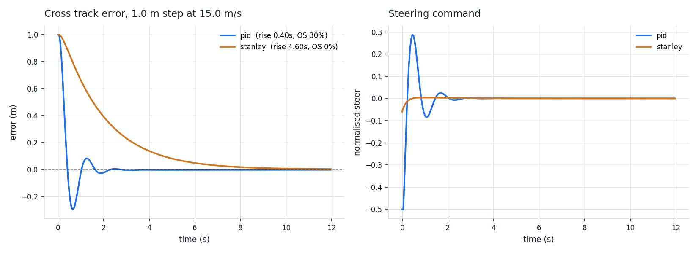

# CARLA Lane Control

Vision based lane perception and lateral control for CARLA and ROS 2. One
forward camera in, a metric lane measurement and a steering command out, at
20 Hz on a CPU.

**Measured on real highway footage: 1260 / 1260 frames accepted, 20.3 FPS at
720p on two vCPUs with no GPU, and a mean frame to frame offset change of
4.4 mm.** Every number in [`docs/RESULTS.md`](docs/RESULTS.md) is labelled
`LOCAL RESULT` or `REFERENCE RESULT`, and nothing is claimed that was not run.


## Overview

The pipeline recovers lane geometry from a single camera and closes a steering
loop around it:

1. undistort the frame using intrinsics fitted from chessboard views
2. isolate lane paint with colour and gradient thresholds
3. warp to a bird's eye view, where lane lines are parallel and a polynomial
   fit means something metric
4. find the two lane lines with a sliding window search, or a band around the
   previous frame's fit
5. convert to metres and derive lateral offset, heading error and curve radius
6. feed a PID or Stanley lateral controller, and a longitudinal controller
   whose target speed is capped by the curvature ahead

## Problem

A lane keeping controller needs three numbers: how far the vehicle is from the
lane centre, in metres; how much its heading differs from the lane; and how
tight the curve ahead is. Getting those from a camera has three requirements
that pull against each other.

**It has to be metric.** A controller consuming pixels has gains that mean
nothing and cannot move between cameras. The conversion depends on the camera
mounting, which means it has to be measured, not assumed. This repository
measures it — [`scripts/measure_scale.py`](scripts/measure_scale.py) — and the
two straight road frames cross check to 2.3 percent.

**It has to run at rate.** At 20 Hz anything slower than 50 ms per frame means
the controller is acting on stale data. Measured here: 43 ms for perception on
two vCPUs, leaving 7 ms of margin with no GPU involved.

**It has to know when it is wrong.** A detector that returns a confident wrong
lane is worse than one that returns nothing, because the controller cannot tell
the difference. Every fit here is gated on lane width, and a rejected frame
carries the previous geometry forward marked invalid rather than lurching.

## Architecture

```
frame ─► undistort ─► lane mask ─► ROI ─► bird's eye warp
                                              │
                              ┌───────────────┴───────────────┐
                        prior valid?                    no prior
                              │                               │
                     search around prior            sliding window search
                              └───────────────┬───────────────┘
                                              ▼
                                 polyfit ×2 ─► smooth (α 0.75)
                                              ▼
                              gate: 2.5 m ≤ lane width ≤ 5.0 m
                                     │                 │
                                   pass              reject ─► carry prior,
                                     │                          drops += 1
                                     ▼                          (>5 → reset)
                    offset (m), heading (rad), radius (m)
                                     │
                     ┌───────────────┴───────────────┐
                     ▼                               ▼
             PID / Stanley                   longitudinal P
             → steer                         + curvature speed cap
                                             → throttle, brake
```

[`docs/PIPELINE.md`](docs/PIPELINE.md) has the full diagram and a stage by
stage description.

## Features

- **Camera calibration** from chessboard views, with distortion correction
- **Measured metric scale** rather than a copied constant, with a guard that
  catches the common silent failure of measuring a solid line as a dash
- **Classical lane extraction** combining HLS lightness, LAB yellow, and
  saturation gated gradient — no training, no GPU
- **Temporal tracking** with a search around the previous fit, coefficient
  smoothing, and a fallback to full search after repeated rejections
- **Two lateral controllers**, PID and Stanley, measurably compared
- **A kinematic bicycle model** so the controller can be scored in closed loop
  without a simulator
- **A ROS 2 node** with the decision logic factored out and unit tested
- **A direct CARLA client** that logs the simulator's ground truth lane centre
- **80 tests**, and a CLI where every stage runs on its own

## Project structure

```
carla-lane-control/
├── README.md
├── LICENSE                     MIT
├── pyproject.toml              packaging, `lanectl` entry point
├── requirements.txt            pinned to the versions in docs/RESULTS.md
├── pytest.ini
├── configs/
│   └── highway.yaml            every tunable number, with the measured scale
├── src/lanectl/
│   ├── calibration.py          chessboard intrinsics, undistortion
│   ├── config.py               dataclass config, YAML loading
│   ├── perception.py           lane pixel mask, perspective transform
│   ├── lane.py                 window search, polyfit, curvature, offset
│   ├── control.py              PID, Stanley, bicycle model, metrics
│   ├── pipeline.py             frame in, measurement and overlay out
│   ├── ros2_node.py            ROS 2 wiring (NOT executed in the results)
│   └── cli.py                  calibrate / detect / simulate / bench
├── scripts/
│   ├── download_data.sh        fetches the dataset, writes the attribution
│   ├── measure_scale.py        measures pixels per metre
│   ├── plot_results.py         builds the figures in docs/RESULTS.md
│   └── carla_run.py            CARLA client (NOT executed in the results)
├── tests/                      80 tests
├── data/                       downloaded, never committed
├── outputs/                    calibration, overlays, traces, figures
└── docs/
    ├── RESEARCH.md             prior work, approach, and why
    ├── PIPELINE.md             what was built, stage by stage
    └── RESULTS.md              what it actually did
```

## Requirements

**To run everything in `docs/RESULTS.md`:** Python 3.10+, a CPU, about 100 MB
of disk for the dataset. No GPU. The published results came from two vCPUs.

**Additionally, for the simulator paths** (neither of which was run when
producing the results): ROS 2 Humble or newer with the CARLA ROS bridge, and a
CARLA 0.9.15 server with a GPU.

## Installation

```bash
git clone https://github.com/shanmugaraja007/carla-lane-control.git
cd carla-lane-control

python -m venv .venv
source .venv/bin/activate          # Windows: .venv\Scripts\activate

pip install -r requirements.txt
pip install -e .
```

Check it:

```bash
python -m pytest        # expect: 80 passed
lanectl --help
```

## Dataset

Nothing is committed. Fetch it with:

```bash
bash scripts/download_data.sh            # 20 chessboards + 8 stills, ~4 MB
bash scripts/download_data.sh --video    # also the 1260 frame clip, 25 MB
```

On Windows without a bash shell, download the `camera_cal/` and `test_images/`
directories from https://github.com/udacity/CarND-Advanced-Lane-Lines into
`data/raw/`.

Source: **Udacity CarND Advanced Lane Finding**, MIT licensed, Copyright (c)
2016-2018 Udacity, Inc. It was chosen over the larger CULane and TuSimple
because it is the only public set carrying chessboard views *and* road frames
from the same camera. Without that pairing there is no calibration, and without
calibration no metric claim is trustworthy.

**No model weights are needed.** Nothing here is trained.

## Usage

Two setup commands, run once per camera:

```bash
export PYTHONPATH=src     # or `pip install -e .` and drop this

# 1. camera intrinsics
lanectl calibrate data/raw/camera_cal -o outputs/calibration/camera.json --undistort-sample

# 2. pixels per metre, printed for pasting into the config
python scripts/measure_scale.py data/raw/test_images/straight_lines1.jpg
```

Then:

```bash
# lane perception over stills, with the intermediate stages
lanectl detect data/raw/test_images -c configs/highway.yaml -o outputs/detect --save-stages

# over a video
lanectl detect data/raw/project_video.mp4 -c configs/highway.yaml -o outputs/video

# closed loop controller comparison, 1 m step at 15 m/s
lanectl simulate -c configs/highway.yaml --initial-offset 1.0 --speed 15 --duration 12

# the same on a 200 m radius curve
lanectl simulate -c configs/highway.yaml --initial-offset 0 --curve-radius 200

# with perception noise
lanectl simulate -c configs/highway.yaml --initial-offset 1.0 --noise 0.05

# throughput
lanectl bench data/raw/test_images -c configs/highway.yaml --repeats 6
```

## Example

```console
$ lanectl detect data/raw/test_images -c configs/highway.yaml -o outputs/detect
straight_lines1.jpg      offset +0.079 m  width 3.80 m  R    21966 m  ok  167.7 ms
straight_lines2.jpg      offset +0.055 m  width 3.78 m  R    28657 m  ok   53.7 ms
test1.jpg                offset -0.113 m  width 3.88 m  R     2011 m  ok   52.8 ms
test2.jpg                offset -0.322 m  width 3.93 m  R     1736 m  ok   54.9 ms
test3.jpg                offset -0.057 m  width 3.88 m  R     2080 m  ok   51.9 ms
test4.jpg                offset -0.269 m  width 4.05 m  R     2364 m  ok   55.5 ms
test5.jpg                offset +0.090 m  width 4.09 m  R     2942 m  ok   49.6 ms
test6.jpg                offset -0.216 m  width 4.00 m  R     1601 m  ok   53.4 ms

8/8 frames accepted -> outputs/detect/detections.json
```

As a library:

```python
import cv2
from lanectl import CameraCalibration, LanePipeline, PipelineConfig

cfg = PipelineConfig.load("configs/highway.yaml")
pipeline = LanePipeline(cfg, CameraCalibration.load(cfg.calibration_path))

result = pipeline.process(cv2.imread("frame.jpg"))
print(f"{result.lane.lateral_offset_m:+.3f} m from centre, steer {result.steer_command:+.3f}")
```

## Results

Full detail, with commands and figures, in [`docs/RESULTS.md`](docs/RESULTS.md).

**Perception, 1260 frame highway clip** — `LOCAL RESULT`

| | |
| --- | --- |
| Frames accepted | **1260 / 1260 (100 %)** |
| Frame to frame \|Δoffset\|, mean | **0.0044 m** (max 0.0237 m) |
| Lane width error, straight frames | **0.090 m (2.4 %)** vs the 3.70 m standard |
| Lane width error, curved frames | 0.271 m (7.3 %) |
| Throughput, 720p, 2 vCPU, no GPU | **20.3 FPS** (49.26 ms mean) |

**Controllers, closed loop on the kinematic bicycle model** — `LOCAL RESULT`

| | PID | Stanley |
| --- | ---: | ---: |
| Step: rise time | **0.40 s** | 4.60 s |
| Step: overshoot | 29.8 % | **0.0 %** |
| Step: RMSE | **0.146 m** | 0.313 m |
| 200 m curve: RMSE | **0.049 m** | 0.451 m |
| 200 m curve: steady state error | **0.044 m** | 0.520 m |



The reversal between the two rows is the useful finding. Stanley wins the step
and loses the curve by an order of magnitude, holding a 0.52 m standing offset,
because it has no feedforward curvature term and the PID's integrator does that
job. For highway lane keeping the PID is the better default of the two as
implemented.

## Evaluation

| Metric | Why this one |
| --- | --- |
| **Acceptance rate** | The gate is the only self assessment the pipeline has. A high rate on real footage says it is not silently degrading. |
| **Lane width vs 3.70 m** | The only ground truth available, and a good one because the pipeline never optimises for it. |
| **Frame to frame Δoffset** | What decides whether the derivative term is differentiating signal or noise. An aggregate hides this completely. |
| **Rise time, overshoot, settling, RMSE** | Standard step response characterisation of a controller. |
| **Mean / p50 / p95 latency** | The p95 is what has to fit in the 50 ms budget, not the mean. |

Not measured, and not claimed: image space F1 (the sample set has no lane
annotations) and offset against instrumented ground truth (needs RTK or a
simulator).

## Reproducibility

Every command that produced every number is listed in
[`docs/RESULTS.md`](docs/RESULTS.md#execution), in order. Dependencies are
pinned in `requirements.txt` to the exact versions used. There is nothing
trained, so a run is fully determined by the config file plus the commit.

The stochastic pieces are seeded: `lanectl simulate --noise` takes `--seed`,
defaulting to 0.

Expect small differences in the latency figures on different hardware, and none
at all in the calibration, geometry or control numbers.

## Limitations

Stated fully in [`docs/RESULTS.md`](docs/RESULTS.md#limitations). The ones that
matter most:

- **The ROS 2 node and the CARLA client were never executed.** No ROS 2, no
  simulator, no GPU in the environment the results came from. The code is
  published as integration code; the logic inside it is unit tested, the
  message plumbing is not. **No CARLA number appears anywhere in this
  repository.**
- **Metric accuracy is three times worse on curves** than on straights, because
  the homography assumes a planar straight patch. Quantified, not fixed.
- **Thresholds are domain specific**: dry, sunlit US Interstate. Night, rain,
  snow and worn paint are untested and expected to fail.
- **The controller was validated on a kinematic model**, so no tyre slip, no
  actuator dynamics, no steering rate limit. Real overshoot will be worse.
- **Latency is measured but not compensated.** 49 ms at 15 m/s means the
  measurement describes where the vehicle was 0.74 m ago.

## References

- Thrun, S. et al. (2006). *Stanley: The Robot that Won the DARPA Grand
  Challenge.* Journal of Field Robotics 23(9).
- Dosovitskiy, A. et al. (2017). *CARLA: An Open Urban Driving Simulator.*
  CoRL. [arXiv:1711.03938](https://arxiv.org/abs/1711.03938)
- Zheng, T. et al. (2022). *CLRNet: Cross Layer Refinement Network for Lane
  Detection.* CVPR. [arXiv:2203.10350](https://arxiv.org/abs/2203.10350)
- Honda, H. and Uchida, Y. (2023). *CLRerNet: Improving Confidence of Lane
  Detection with LaneIoU.* [arXiv:2305.08366](https://arxiv.org/abs/2305.08366)
- Qin, Z. et al. (2020). *Ultra Fast Structure aware Deep Lane Detection.*
  ECCV. [arXiv:2004.11757](https://arxiv.org/abs/2004.11757)
- [CARLA ROS bridge](https://github.com/carla-simulator/ros-bridge)
- [PID Controller, ROS 2 and CARLA](https://learnopencv.com/pid-controller-ros-2-carla/)
  — source of the reference gains
- [OpenCV camera calibration](https://docs.opencv.org/4.x/dc/dbb/tutorial_py_calibration.html)
- [Udacity CarND Advanced Lane Finding](https://github.com/udacity/CarND-Advanced-Lane-Lines)
  — the dataset, MIT licensed

## Licence

MIT. See [LICENSE](LICENSE).

The sample data is MIT licensed by Udacity and is downloaded, not redistributed
here; the attribution is written to `data/README.md` by the download script.
