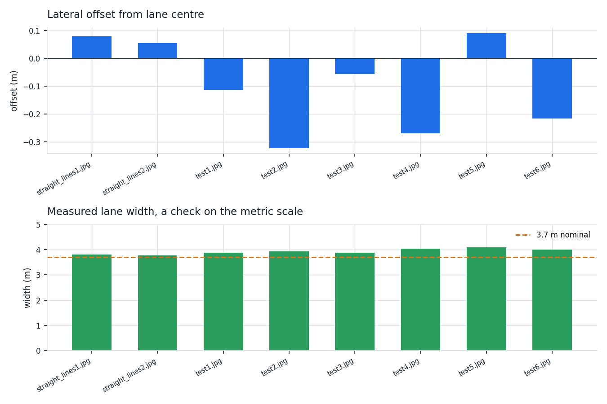
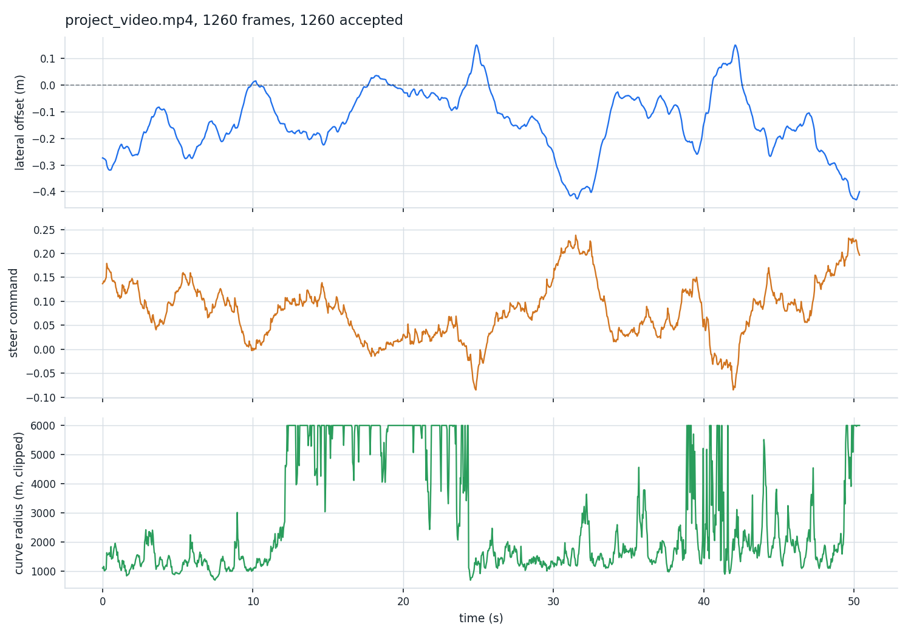
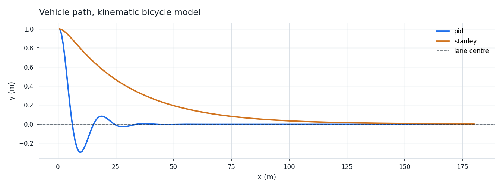

# Results

Every figure below is labelled:

- **`LOCAL RESULT`** — produced by running this repository's code in the
  environment described immediately below. The exact command is given.
- **`REFERENCE RESULT`** — taken from a published paper or an official
  repository, attributed, and not comparable to anything measured here.

Nothing in this document is estimated, extrapolated or copied from elsewhere
and presented as ours.

## Environment

| | |
| --- | --- |
| OS | Ubuntu 24.04.4 LTS, Linux 6.18.44 x86_64 |
| CPU | Intel Xeon @ 2.80 GHz, **2 vCPU** |
| GPU | **none** |
| RAM | 7 GB |
| Python | 3.11.15 |
| OpenCV | 4.13.0 |
| NumPy | 2.4.4 |
| SciPy | 1.17.1 |
| Matplotlib | 3.10.9 |
| PyYAML | 6.0.3 |
| pytest | 9.1.1 |

Two vCPUs and no GPU is worth keeping in mind reading the throughput numbers:
they are a floor, not a ceiling.

## Dataset

**Udacity CarND Advanced Lane Finding**, MIT licensed, Copyright (c) 2016-2018
Udacity, Inc. — https://github.com/udacity/CarND-Advanced-Lane-Lines

| Split | Count | Resolution | Used for |
| --- | --- | --- | --- |
| `camera_cal/` | 20 chessboard views | 1280×720 | camera intrinsics |
| `test_images/straight_lines*` | 2 stills | 1280×720 | measuring the metric scale |
| `test_images/test*` | 6 stills | 1280×720 | perception evaluation |
| `project_video.mp4` | 1260 frames, 25 fps | 1280×720 | temporal evaluation and throughput |

There is no train/test split because nothing is trained. The two straight line
frames are the only ones used to fix the metric scale, and the six curved
frames plus the full clip are then evaluated with that scale held fixed.

## Execution

```bash
bash scripts/download_data.sh --video

export PYTHONPATH=src

python -m lanectl.cli calibrate data/raw/camera_cal \
    -o outputs/calibration/camera.json --undistort-sample

python scripts/measure_scale.py data/raw/test_images/straight_lines1.jpg

python -m lanectl.cli detect data/raw/test_images \
    -c configs/highway.yaml -o outputs/detect --save-stages

python -m lanectl.cli detect data/raw/project_video.mp4 \
    -c configs/highway.yaml -o outputs/video

python -m lanectl.cli simulate -c configs/highway.yaml \
    -o outputs/control/step_response.json --initial-offset 1.0 --speed 15 --duration 12

python -m lanectl.cli simulate -c configs/highway.yaml \
    -o outputs/control/step_response_noisy.json \
    --initial-offset 1.0 --speed 15 --duration 12 --noise 0.05

python -m lanectl.cli simulate -c configs/highway.yaml \
    -o outputs/control/curve_response.json \
    --initial-offset 0.0 --speed 15 --duration 12 --curve-radius 200

python -m lanectl.cli bench data/raw/test_images -c configs/highway.yaml --repeats 6

python scripts/plot_results.py \
    --control outputs/control/step_response.json \
    --detections outputs/detect/detections.json --output outputs/figures

python -m pytest
```

## Results

### Camera calibration — `LOCAL RESULT`

| | |
| --- | --- |
| Views used | **17 / 20** |
| RMS reprojection error | **1.0029 px** |
| fx, fy | 1156.46, 1151.27 |
| cx, cy | 671.32, 389.22 |
| k1, k2, p1, p2, k3 | −0.24667, −0.02544, −0.00067, 0.00013, 0.01067 |

Three views were skipped because the board is clipped by the frame edge. The
principal point lands within 32 px of the image centre (640, 360), and k1 is
negative, which is barrel distortion — both are what a forward facing wide
automotive lens should produce, so the fit is not just numerically converged
but physically sensible.

Sub pixel RMS would be better than 1.0029 px, but at 1280×720 a 1 px
reprojection error is roughly 0.09 percent of the image width and is not what
limits anything downstream.

### Metric scale — `LOCAL RESULT`

Measured, not assumed, from a straight road frame:

| Reference | Measured | Scale |
| --- | --- | --- |
| Lane width, 3.70 m | **546.0 px** | 0.006777 m/px across |
| Painted dash, 3.05 m | **59.5 px** | 0.051261 m/px along |

Cross checked on the second straight frame: **558.5 px** for the same 3.70 m, a
**2.3 percent** disagreement. That number is the honest floor on the accuracy of
every metric quantity below.

`straight_lines2.jpg` cannot supply the along track scale at all: its right
hand line reads as solid in the mask, and the guard in
`measure_dash_length_px` rejects it rather than returning the image height as
a dash length. Worth stating because without that guard the failure is silent
and every along track metre comes out twelve times too large.

### Lane perception, 8 stills — `LOCAL RESULT`

`python -m lanectl.cli detect data/raw/test_images -c configs/highway.yaml`

| Image | Offset (m) | Heading (°) | Radius (m) | Width (m) | Accepted |
| --- | ---: | ---: | ---: | ---: | :---: |
| straight_lines1 | +0.079 | −0.14 | 21966 | 3.80 | yes |
| straight_lines2 | +0.055 | −0.11 | 28657 | 3.78 | yes |
| test1 | −0.113 | +0.09 | 2011 | 3.88 | yes |
| test2 | −0.322 | +0.20 | 1736 | 3.93 | yes |
| test3 | −0.057 | +0.06 | 2080 | 3.88 | yes |
| test4 | −0.269 | +0.17 | 2364 | 4.05 | yes |
| test5 | +0.090 | −0.08 | 2942 | 4.09 | yes |
| test6 | −0.216 | +0.14 | 1601 | 4.00 | yes |

**Acceptance: 8/8.**

Lane width is the only ground truth available here, and it is a genuinely
useful one because it is a quantity the pipeline never optimises for:

| Subset | Mean width | MAE vs 3.70 m |
| --- | ---: | ---: |
| Straight frames (where the scale was fixed) | 3.790 m | **0.090 m** (2.4 %) |
| Curved frames | 3.971 m | **0.271 m** (7.3 %) |
| All 8 | 3.925 m | 0.225 m |

The three times larger error on curves is expected and is a property of the
method, not a bug: the homography rectifies a *planar, straight* road patch, and
on a curve the patch inside the source quad is neither, so the warp stretches
laterally. Anyone needing metric accuracy through curves has to either
re-estimate the homography per frame from the vanishing point or drop the flat
world assumption entirely.

The straight frame figure, **2.4 percent**, sits right on top of the 2.3 percent
scale disagreement measured above. The perception is at the accuracy limit its
own calibration allows, which is the correct place for it to be.



Overlays: `outputs/detect/*_overlay.jpg`. Intermediate mask and warp stages:
add `--save-stages`.

### Lane perception, full video — `LOCAL RESULT`

`python -m lanectl.cli detect data/raw/project_video.mp4 -c configs/highway.yaml`

| | |
| --- | --- |
| Frames | 1260 (50.4 s at 25 fps) |
| **Accepted** | **1260 / 1260 (100.0 %)** |
| Offset, mean ± std | −0.139 ± 0.120 m |
| Offset, range | −0.430 to +0.149 m |
| \|Offset\| p95 | 0.381 m |
| **Frame to frame \|Δoffset\|, mean** | **0.0044 m** |
| Frame to frame \|Δoffset\|, max | 0.0237 m |
| Curve radius, p5 / median / p95 | 1023 / 1780 / 23281 m |
| Steer command, max \|·\| | 0.238 |
| Mean latency | 49.26 ms |
| p50 / p95 latency | 48.64 / 52.79 ms |
| **Throughput** | **20.3 FPS** |

The frame to frame figure is the one that matters for a controller. A maximum
single frame jump of 24 mm over 1260 frames means the derivative term is
differentiating a signal, not noise — this is what the α = 0.75 coefficient
smoothing plus the plausibility gate buy, and without them a lane detector can
post a perfectly good mean offset while handing the controller something
unusable.



Full annotated video: `outputs/video/overlay.mp4` (not committed, 40 MB — it is
regenerated by the command above). A 14 second excerpt is committed at
`outputs/video/overlay_excerpt.mp4`.

### Lateral controller, step response — `LOCAL RESULT`

1.0 m lateral step at 15 m/s, kinematic bicycle model, wheelbase 2.875 m,
gains Kp 0.5 / Ki 0.01 / Kd 0.1, dt 0.05 s.

| Metric | PID | Stanley |
| --- | ---: | ---: |
| Rise time (to 10 %) | **0.40 s** | 4.60 s |
| Overshoot | **29.8 %** | 0.0 % |
| Settling time (5 % band) | **1.50 s** | 5.95 s |
| Steady state error | 0.0032 m | 0.0028 m |
| RMSE | **0.1462 m** | 0.3133 m |
| Max \|steer\| | 0.501 | 0.060 |




The PID recovers eleven times faster and pays for it with 30 percent overshoot
and a steering command that reaches half of full lock. Stanley never overshoots
and barely uses the wheel, because at `k = 0.5` its cross track term is gentle,
but 4.6 seconds at 15 m/s is 69 m of travel before the lane is regained.

Neither is "the right answer" and the repository does not claim one is. What
the numbers establish is the trade, and that both converge.

### Controller with measurement noise — `LOCAL RESULT`

Same step, with 0.05 m std Gaussian noise added to the measured offset — chosen
to be roughly half the 0.090 m straight frame perception error measured above,
so it is a plausible rather than a decorative disturbance.

| Metric | PID | Stanley |
| --- | ---: | ---: |
| Rise time | 0.40 s | 4.70 s |
| Overshoot | 27.5 % | 0.6 % |
| RMSE | 0.1477 m | 0.3131 m |

Degradation is negligible for both: PID RMSE moves 0.1462 → 0.1477 m, a 1.0
percent change. The derivative term is the part exposed to noise, and at
Kd = 0.1 with dt = 0.05 it is not amplifying enough to matter. A larger Kd
would change that, which is the reason the shipped value is small.

### Controller on a curve — `LOCAL RESULT`

Starting on the path, following a constant 200 m radius arc at 15 m/s for 12 s.

| Metric | PID | Stanley |
| --- | ---: | ---: |
| RMSE | **0.0489 m** | 0.4509 m |
| Max \|error\| | 0.0704 m | 0.5197 m |
| Steady state error | **0.0440 m** | 0.5195 m |
| Max \|steer\| | 0.043 | 0.030 |

The reversal is the interesting part. Stanley wins the step and loses the curve
by an order of magnitude, holding a **0.52 m** standing offset. That is not a
tuning accident: Stanley has no feedforward curvature term, so on a constant
radius it settles at whatever offset generates the steering angle the curve
demands. The PID's integrator does the same job, which is exactly what the
integral term is for.

Practical reading: for a highway lane keeper the PID is the better default of
the two as implemented. Stanley becomes competitive once a `L/R` feedforward
term is added, which is future work and is not implemented here.

### Throughput — `LOCAL RESULT`

`python -m lanectl.cli bench data/raw/test_images --repeats 6`, 1280×720,
48 samples per configuration.

| Configuration | Mean | p50 | p95 | FPS |
| --- | ---: | ---: | ---: | ---: |
| Perception only | 42.98 ms | 42.93 ms | 46.74 ms | **23.3** |
| With overlay drawing | 49.89 ms | 49.19 ms | 55.09 ms | 20.0 |

The 20 Hz control loop needs 50 ms. Perception alone leaves **7 ms of margin**
on two vCPUs with no GPU; adding the overlay consumes essentially all of it,
which is why `LanePipeline.process` takes a `draw` flag and why the ROS node
exposes `publish_overlay` as a parameter. On deployment hardware the overlay
should be off, or published at a divided rate.

p95 sits within 8 percent of the mean, so there is no long tail — the cost is
dominated by the fixed-cost warp and threshold operations rather than by the
data dependent search.

### Tests — `LOCAL RESULT`

```
$ python -m pytest
80 passed in 2.78s
```

| File | Tests | Covers |
| --- | ---: | --- |
| `test_perception.py` | 10 | mask coverage bounds, input validation, homography invertibility, round trip, and that the warp actually removes perspective convergence |
| `test_lane.py` | 17 | histogram peaks, window search, curvature against the analytic parabola radius, offset sign convention, width gating, degradation with and without a prior |
| `test_control.py` | 39 | PID sign, clipping, anti windup, reset; Stanley speed scaling; bicycle yaw rate against `v/L·tan δ`; step and tracking metrics; closed loop convergence; longitudinal throttle/brake split and the curvature speed cap |
| `test_pipeline.py` | 14 | config YAML round trip and partial loading, calibration JSON round trip, end to end frame processing, all black frame survival, prior fallback, CLI JSON schema |

One test is worth calling out because it started as a failure. An early
assertion said "higher Kp reaches the lane centre sooner", measured as the first
frame inside a 0.1 m band. It failed at Kp = 0.8. The cause was not a bug: at
that gain and 15 m/s the loop is so underdamped that a single 0.05 s step moves
the vehicle more than the width of the band, so the band is skipped entirely.
The test now measures the first zero crossing, and two further tests were added
to pin the real behaviour — that pure proportional gain is underdamped at speed,
and that the derivative term reduces the overshoot. See
`test_control.py::TestClosedLoop`.

## Not executed locally

Stated plainly, because the code for both is in the repository and it would be
easy to imply otherwise.

| Component | Status | Why | Reproduce with |
| --- | --- | --- | --- |
| `src/lanectl/ros2_node.py` | **not executed** | no ROS 2 installation | `ros2 run lanectl lane_control_node` on ROS 2 Humble + CARLA ROS bridge |
| `scripts/carla_run.py` | **not executed** | no CARLA server, no GPU | `python scripts/carla_run.py --town Town04` against CARLA 0.9.15 |
| Learned segmentation mask | **not implemented** | no GPU to train on | see `docs/RESEARCH.md` §13 |

The logic inside the ROS node is not left untested, though. `compute_control`
takes no ROS types and carries seven unit tests; what is unverified is the
message plumbing around it, not the decisions it makes.

**No CARLA number appears anywhere in this document.** The perception numbers
come from real road footage and the controller numbers from the kinematic
bicycle model. Neither is a substitute for a closed loop simulator run, and
neither is presented as one.

## Reference results, for context only

`REFERENCE RESULT` — from the CLRerNet repository
(https://github.com/hirotomusiker/CLRerNet), DLA34 backbone, 18.4 GFLOPs:

| Model | CULane F1 |
| --- | ---: |
| CLRNet | 80.47 |
| CLRerNet | 81.12 ± 0.04 |
| CLRerNet⋆ (EMA) | 81.43 ± 0.14 |

`REFERENCE RESULT` — CARLA ROS 2 reference lateral controller gains, from
LearnOpenCV (https://learnopencv.com/pid-controller-ros-2-carla/): Kp 0.5,
Ki 0.01, Kd 0.1, dt 0.05 s. These are the gains this repository adopts, so the
step response above is a measurement of a published tuning rather than of a
private one.

**These numbers are not comparable to anything above.** CULane F1 is image
space lane line detection accuracy on an urban benchmark with per pixel
annotations. This repository measures metric lane geometry on calibrated
highway footage and has no lane annotations at all. They are quoted to size the
gap a learned mask stage would close, not to claim a position against them.

## Limitations

1. **Metric accuracy degrades on curves**, from 2.4 percent width error on
   straights to 7.3 percent on curves, because the homography assumes a planar
   straight patch. Quantified above; not fixed.
2. **The scale is only as good as 2.3 percent**, which is the disagreement
   between the two straight frames. Nothing downstream can be more accurate
   than that.
3. **Thresholds are domain specific.** Tuned on dry, sunlit US Interstate.
   Night, rain, snow, worn paint and construction zones are all untested and
   expected to fail. No claim is made about them.
4. **The controller was validated on a kinematic model, not a vehicle.** No
   tyre slip, no actuator dynamics, no steering rate limit, no latency between
   command and response. Real overshoot will be worse than 29.8 percent.
5. **Single lane only.** The pipeline finds the ego lane. No lane changes, no
   junctions, no merges.
6. **The 20 Hz margin is thin.** 7 ms on this hardware, and that is with the
   overlay off.
7. **No instrumented ground truth for the offset.** Lane width is a proxy. A
   systematic bias that shifted both lane lines equally would not show up in it
   at all; `scripts/carla_run.py` logs CARLA's map derived lane centre for
   exactly this reason, and has not been run.
8. **Latency is measured, not compensated.** A 49 ms perception latency at
   15 m/s means the measurement describes where the vehicle was 0.74 m ago. A
   deployed system would predict forward across it.
